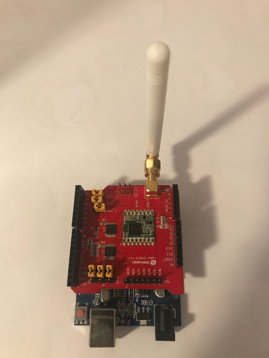

# Fossasat-1Simulator

Simple simulator for Fossasat-1 groundstation testing.

The simulator uses Arduino UNO and a Dragino LoraHat with sx1278 on 436.7Mhz, any MCU / lora module can be used after changing SPI pin definition.
(See comment for Wemos D1 in code)

## Simulation reply is provided for 4 of the 5 Fossasat-1 commands.
   
- 0x00 send ping frame
- 0x01 request satellite info
- 0x02 is not implemented
- 0x03 send message to be retransmitted
- 0x04 request last packet info

Code setup for testing connection to Fossasat Groundstation https://github.com/G4lile0/ESP32-OLED-Fossa-GroundStation

Check the README of the project.

## The SYNC\_WORD discussion.
Fossasat-1 is hardcoded 0x0F0F and it uses an sx1268 lora chip
This SYNC\_WORD will sync with another sx1268 with the same SYNC\_WORD
The sx1278 does not sync with that value even when set to 0xFF
 
Accepted sync words for sx1268 are PRIVATE\_SYNCWORD = 0x1424 and PUBLIC\_SYNCWORD 0x3444.
for the sx1278 to sync it must have PRIVATE\_SYNCWORD = 0x12 and PUBLIC\_SYNCWORD 0x34.
The way it matches is that the top 8 bits of sx1268 first integer in the SYNC\_WORD 0x14 provides  sx1278 SYNC\_WORD with the top 8 bit (1)
and the top 8 bit of sx1268 second integer in the SYNC\_WORD 0x24 provides sx1278 SYNC\_WORD with bottom 8 bits (2)

**SYNC\_WORD in this simulator is 012**, make sure you have the matching SyncWord in your Groundstation.

Same method is used for for PUBLIC\_SYNCWORD.

Note: This does not work for SYNC\_WORD 0x0F0F, which is one used with Fossasat-1.
